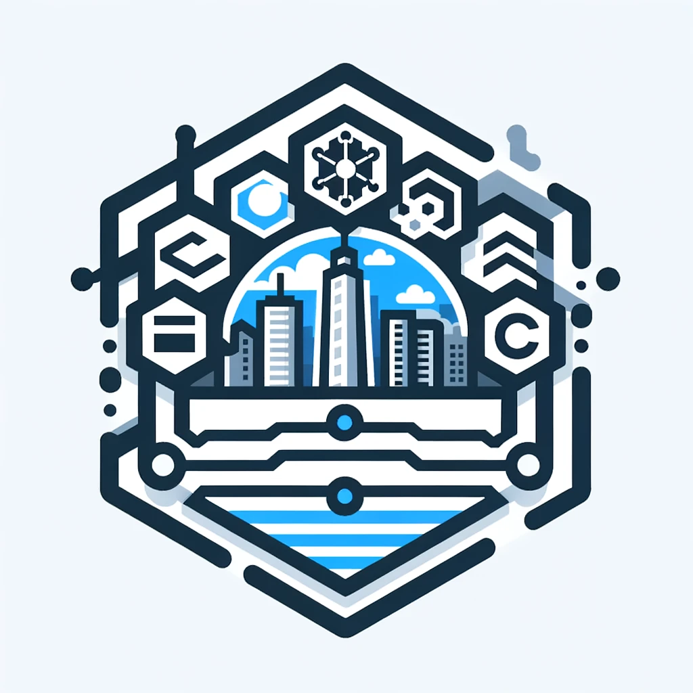

  

# Kommunkod
Ett repositorium av kod för Sveriges kommuner och andra offentliga organisationer. Vissa repositorier visas publikt, men en stor del visas endast internt.

## Ägarskap & Åtkomst
Organisationen ägs, uppdateras och hanteras av ett flertal kommuner, bland annat Höglandets IT (@hoglandev) och Kungsbacka (@Kungsbacka). För att få tillgång till organisationen, skicka ett meddelande till någon av:
- @hoglandev
- @scheibling
- kod@hoglandet.se

## Syfte
Att utbyta kod, moduler till integrationsplatform, synkar och andra program/integrationer som kan vara till nytta för flera organisationer. Att utbyta erfarenheter för att minska behovet av egen utveckling. Att publicera det vi arbetar med som är relevant för allmänheten för att bidra till bättre kod.

## Diskussionsforum/Community
Vi är på gång med att sätta upp ett community, diskussionsforum och eventuellt en gemensam dokumentation (tänk CesamH) för att kunna dela information både internt och publikt, och för att underlätta vårt arbete genom att samarbeta över kommungränserna. Kontakta oss på ovan för mer information.
